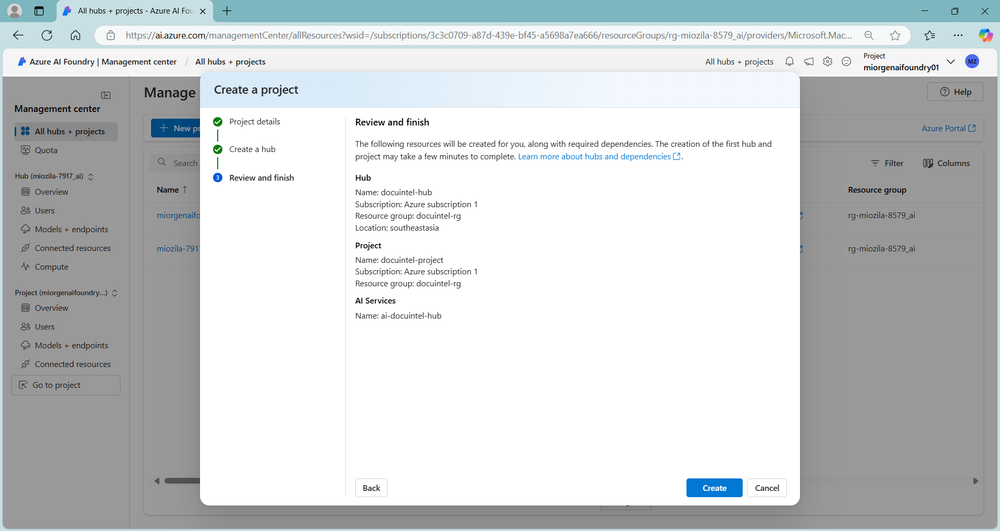
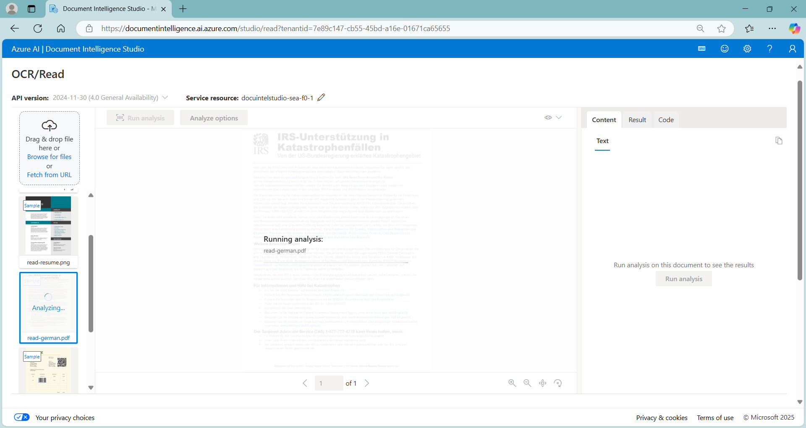
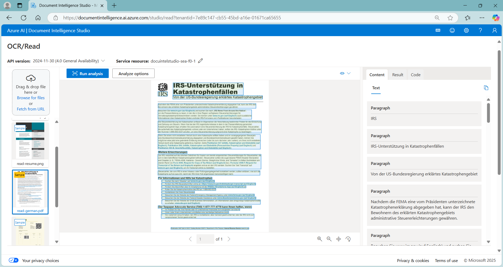
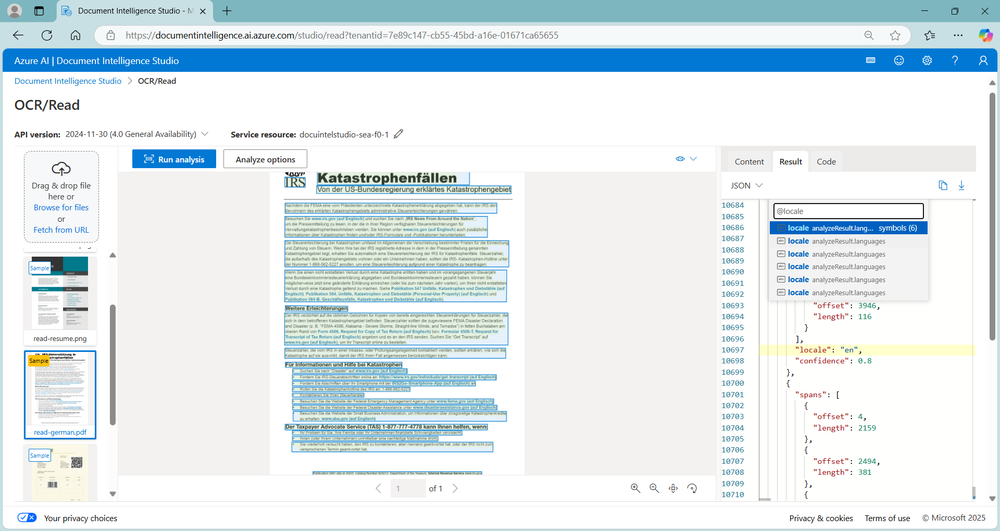
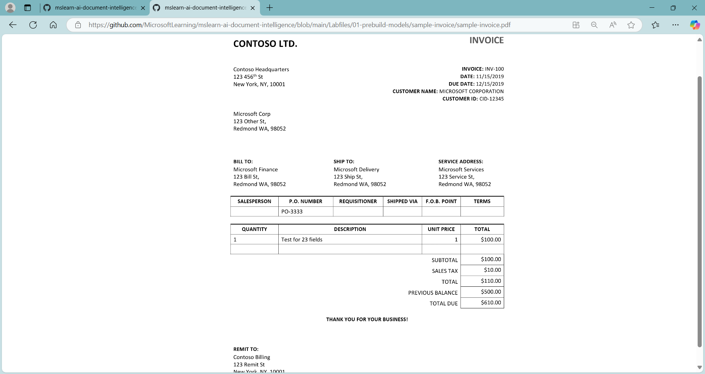
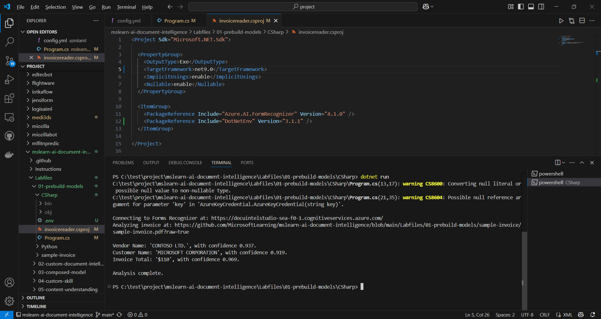
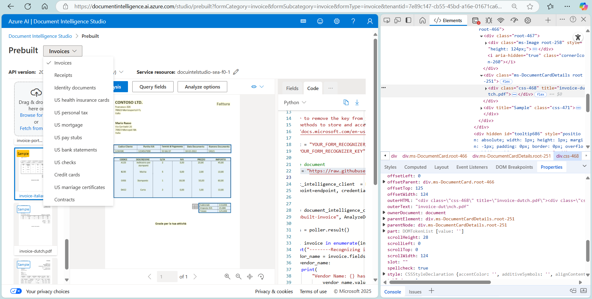
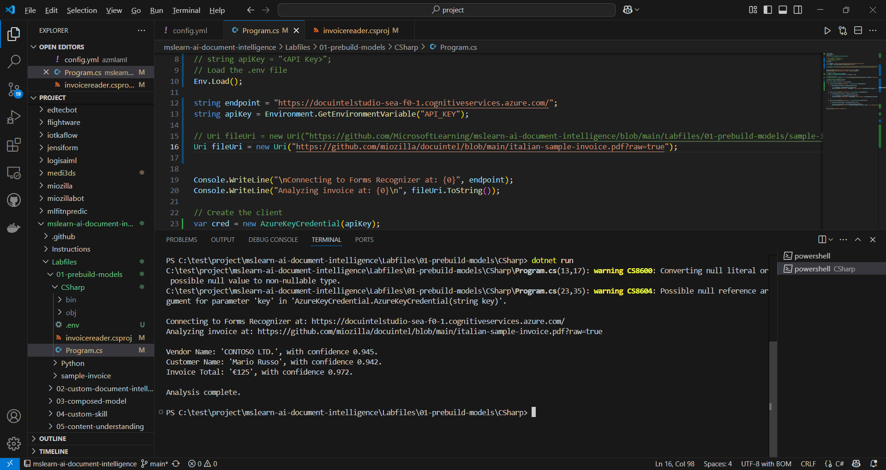
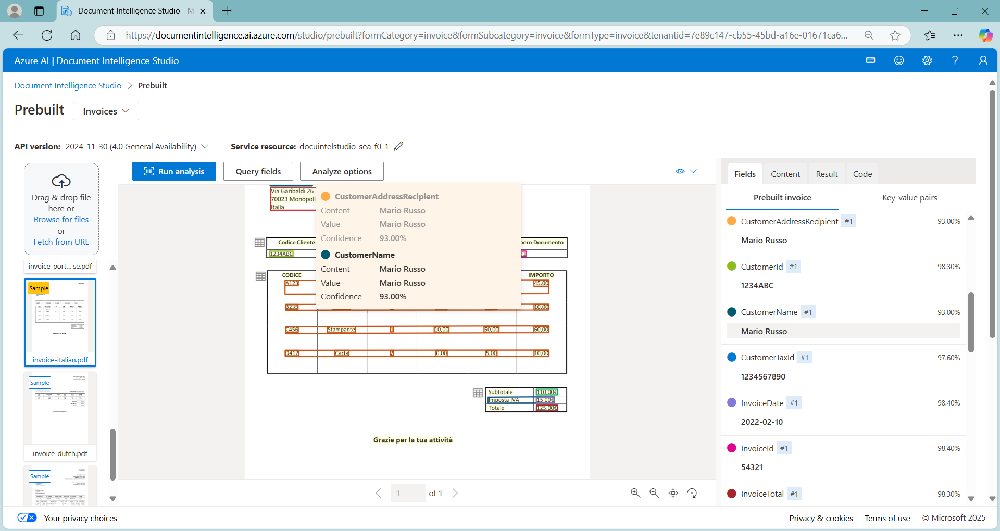
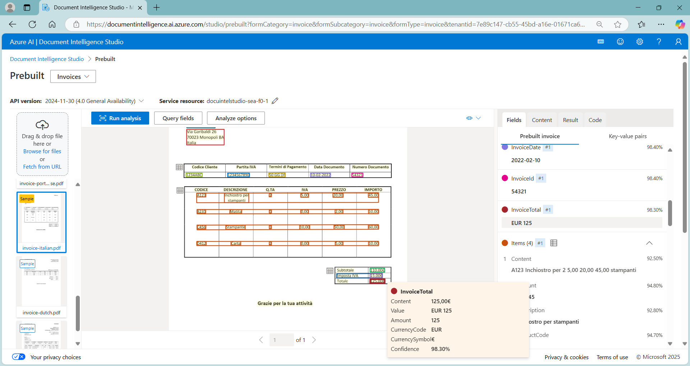

# docuintel 📑
docuintel : #ai_document_intelligence #ocr #csharp #dotnet-sdk #form-recognizer #ai-foundry #document-intelligence-studio 

## Objective
Use prebuilt Document Intelligence models in Azure AI Document Intelligence Studio and C# to submit forms (Invoices/Receipts) to that resource for analysis.

## Azure AI Foundry : Document Intelligence

